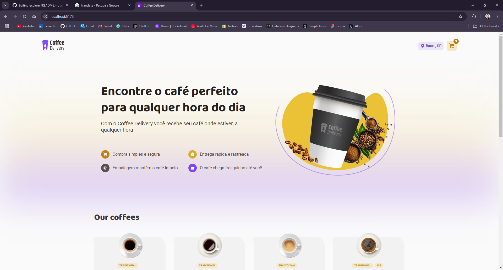
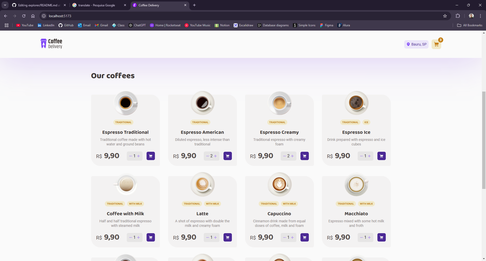
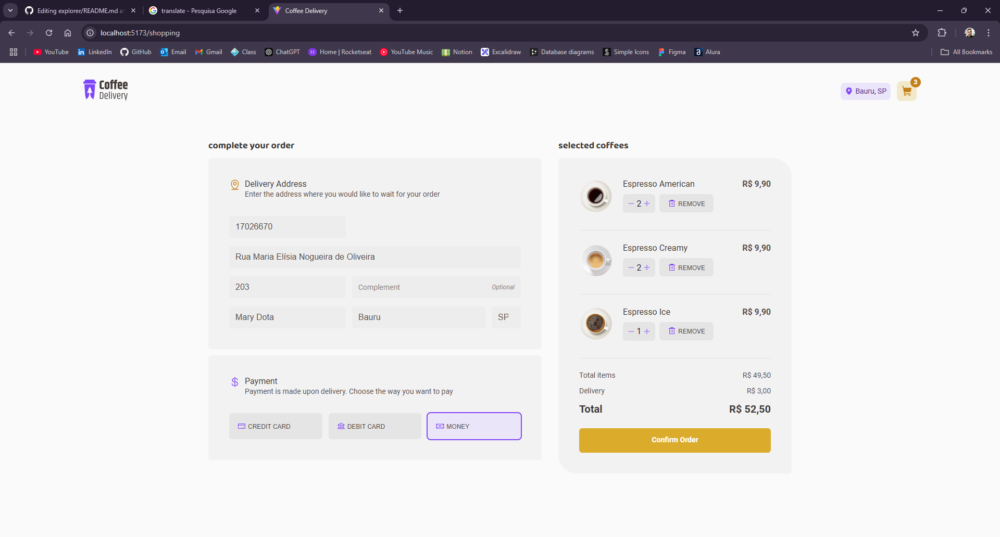
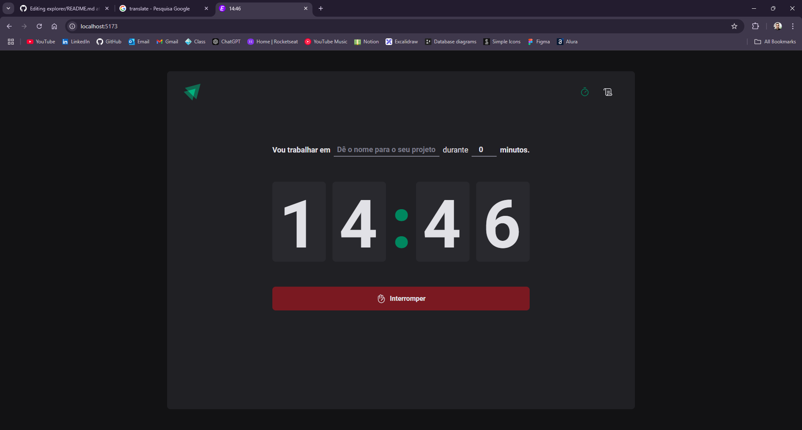
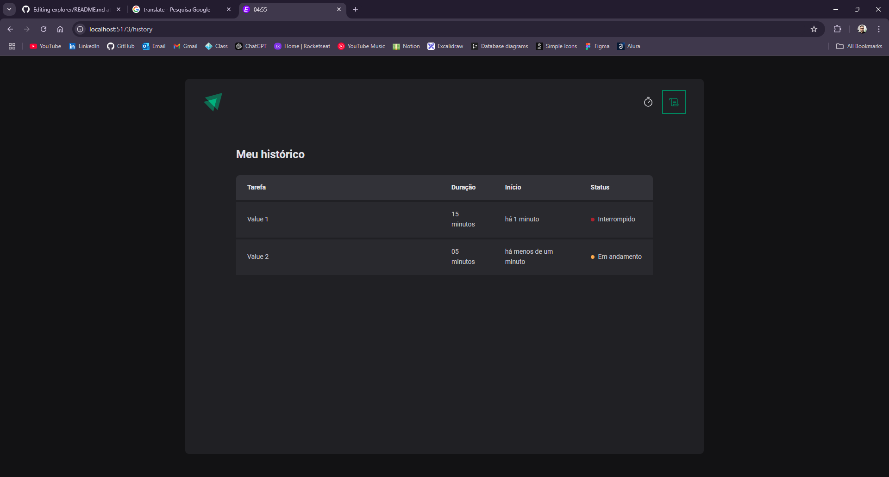
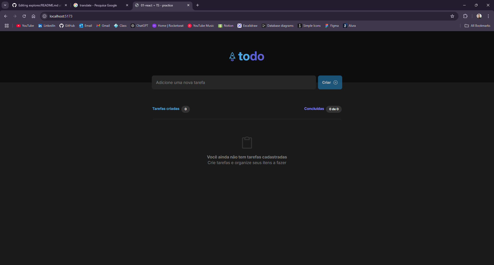
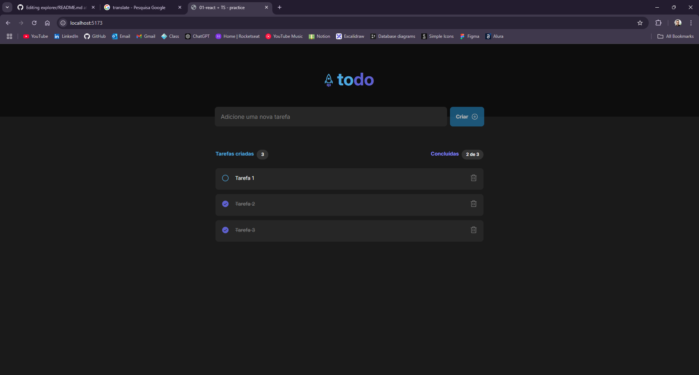
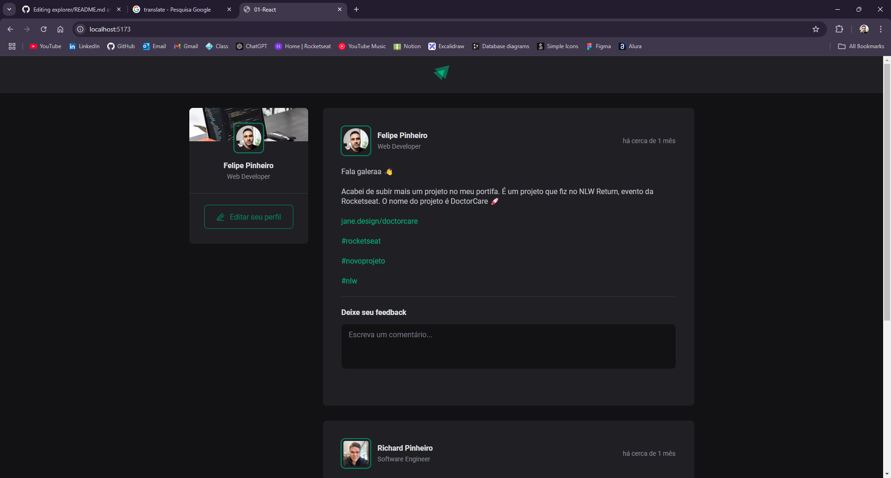
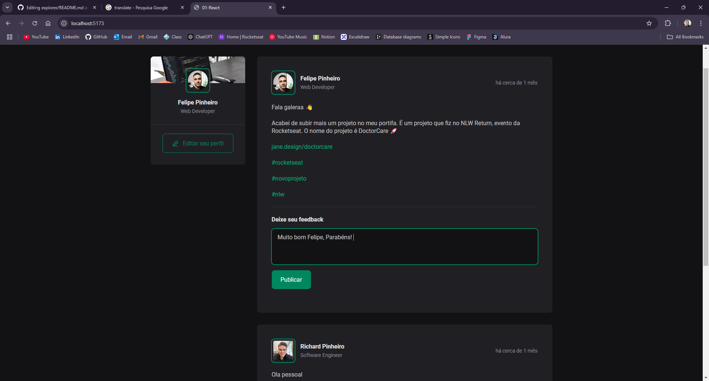
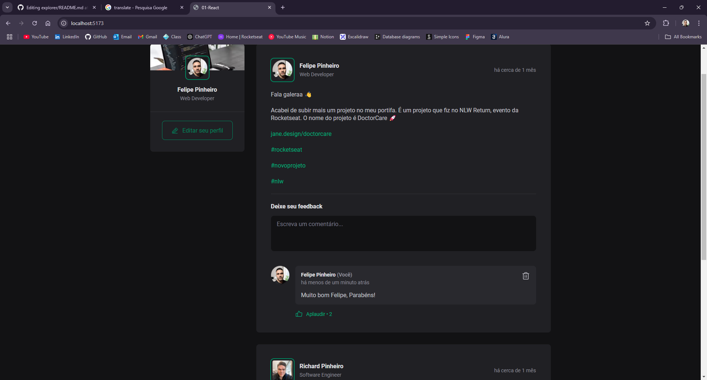

# Hello World :world_map
## this course about react JS and your ecosystem.

### last update 11-30-2024 (month-day-year)

what i've learned so far: using hooks as useState, useEffect, useMemo, useReducer, Context API, customs hooks, useForm, validation as zod with forms of the react-hook-forms, things like immutability of the react, things like inputs controlled e uncontrolled and most.

# Coffee Delivery

# Timer Pomodoro

# To do

# Social Media

