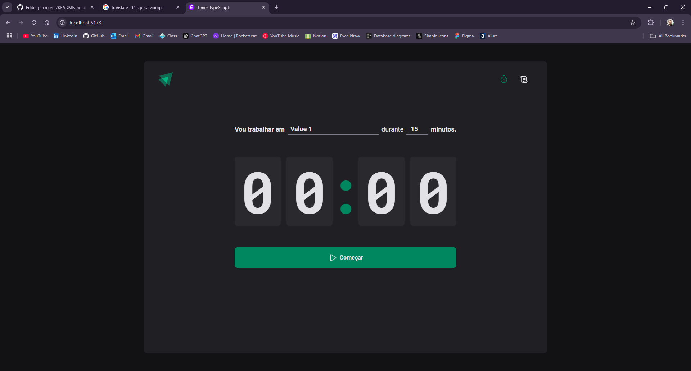

<h1 align='center'>Hello World 🗺️</h1>

## this course about react JS and your ecosystem.

### last update 12-08-2024 (month-day-year)

what i've learned so far: 

Hooks: useState, useEffect, useReducer

Forms: useForm, validation with zod, inputs(uncontrolled, controlled)

Performance: memo, useMemo, useCallback, Context Selector, React Developer Tools

Context Global: Context API, Redux, Redux Toolkit

Data Management: React Query for caching and synchronizing remote states

### [about performance on React](https://github.com/FelipePinheiroRegina/class-reactjs/blob/main/dt-money/README.md)

# DTMoney

### [repository](https://github.com/FelipePinheiroRegina/class-reactjs/tree/main/dt-money)

# Coffee Delivery

### [repository](https://github.com/FelipePinheiroRegina/class-reactjs/tree/main/coffee-delivery)

# Timer Pomodoro

### [repository](https://github.com/FelipePinheiroRegina/class-reactjs/tree/main/timer-ts)

# To do

### [repository](https://github.com/FelipePinheiroRegina/class-reactjs/tree/main/01-react-practice/src)

# Social Media

### [repository](https://github.com/FelipePinheiroRegina/class-reactjs/tree/main/01-react-ts)

