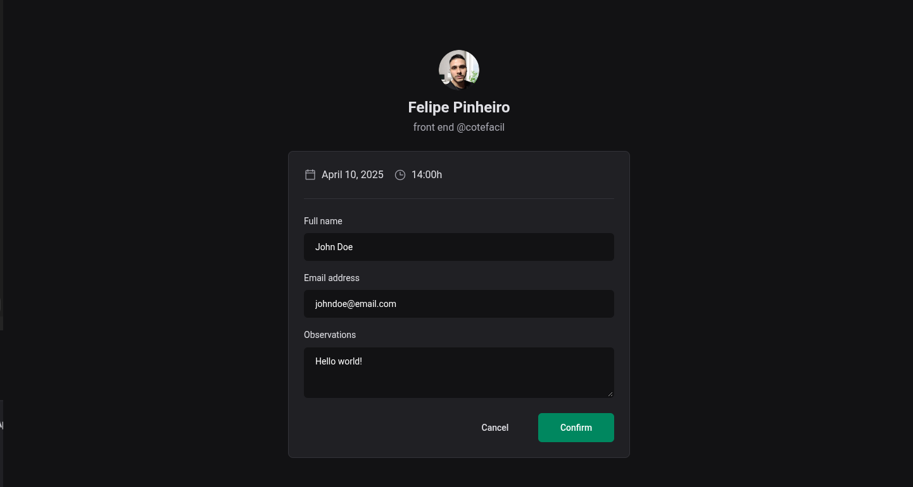

<h1 align='center'>React</h1>

Aprendendo toda a base sobre react e seu ecossistema.

Resumo do que eu aprendi até agora...

- Next (SSR, SSG, SEO)
- Hooks ( useReducer, useCallback, useMemo, customHooks, etc... )
- React Query
- React Hook Form
- Redux
- Context API
- Testes unitários com Vitest
- Testes e2e com Playwright
- Tanstack Table

Styles
- Styled Components
- Material UI
- Emotion
- Stitches
- Chadcn
- Magic UI
- Chakra UI
entre outros...

### [about Next](https://github.com/FelipePinheiroRegina/class-reactjs/blob/main/04-ignite-shop/README.md)
### [about performance on React](https://github.com/FelipePinheiroRegina/class-reactjs/blob/main/dt-money/README.md)

# Projetcs

# Ignite Call

# Ignite Shop

# Pizza Shop

[Repositório](https://github.com/FelipePinheiroRegina/class-reactjs/tree/main/pizza-shop)

# Github Blog

### [repository](https://github.com/FelipePinheiroRegina/class-reactjs/tree/main/github-blog)

# DTMoney

### [repository](https://github.com/FelipePinheiroRegina/class-reactjs/tree/main/dt-money)

# Coffee Delivery

### [repository](https://github.com/FelipePinheiroRegina/class-reactjs/tree/main/coffee-delivery)

# Timer Pomodoro

### [repository](https://github.com/FelipePinheiroRegina/class-reactjs/tree/main/timer-ts)

# To do

### [repository](https://github.com/FelipePinheiroRegina/class-reactjs/tree/main/01-react-practice/src)

# Social Media

### [repository](https://github.com/FelipePinheiroRegina/class-reactjs/tree/main/01-react-ts)

